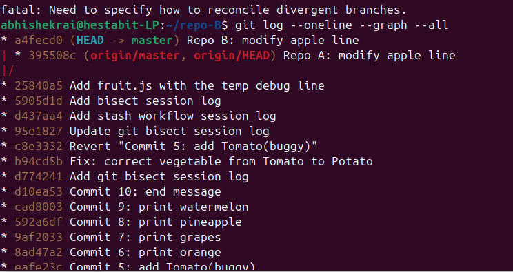
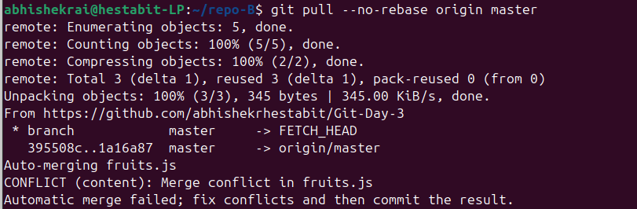
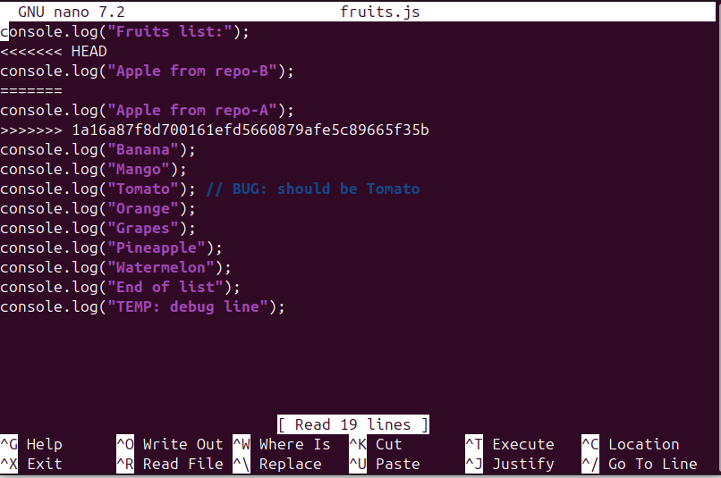
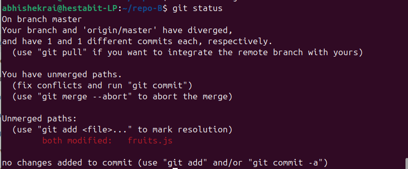
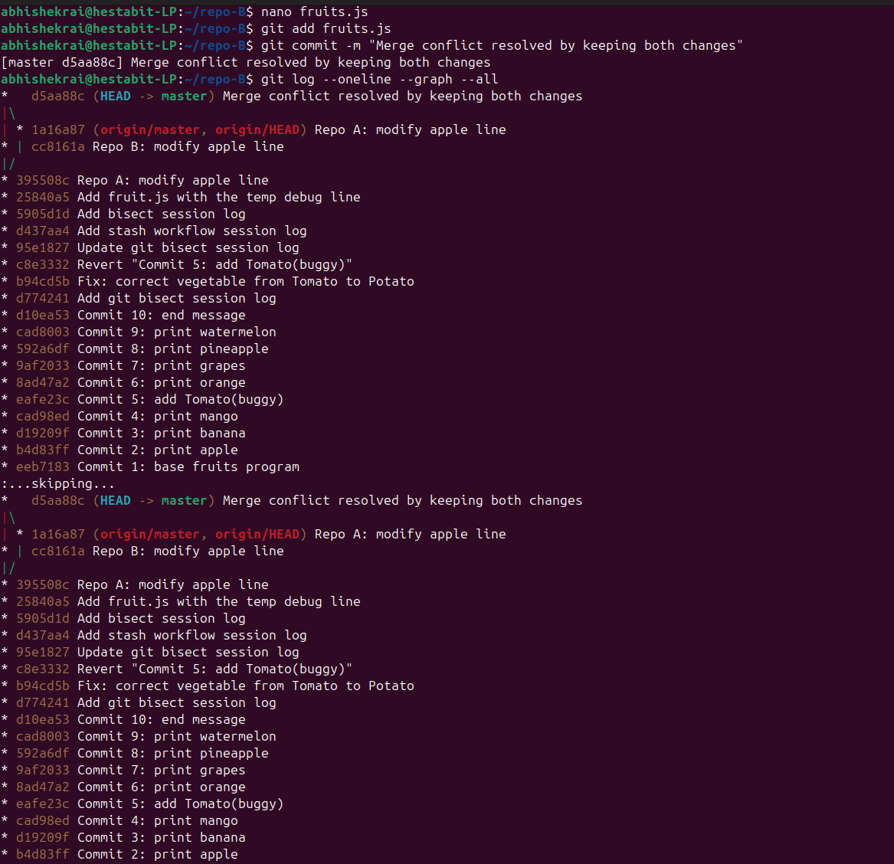

# Merge Conflict Postmortem

## What happened
Two developers modified the same line in `fruits.js` in parallel using separate clones.

## Evidence

###  Diverging commit history before merge
- 

### Git reporting a merge conflict
- 
- 
- 

### Merge commit after resolution
- 

## Why the conflict occurred
Git could not automatically merge changes made to the same line.

## Resolution
Both changes were intentionally preserved by keeping both log statements.

## Lessons Learned
- Pull frequently to avoid large conflicts
- Avoid editing the same lines simultaneously
- Git requires human decisions when intent conflicts
